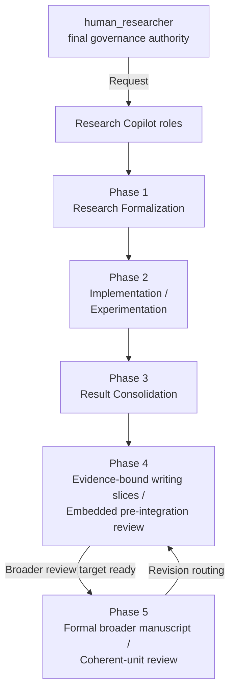

# My AI Research Copilot

<p align="center">
  
</p>

A research operating system for turning broad ideas into defensible evidence, manuscripts, and revisions.

## Architecture

Research Copilot v2 separates reusable kernel behavior from project configuration and mutable project state:

```text
Upstream kernel
→ reusable policies, workflow, skills, templates, guidance, and validation tooling

Project configuration
→ operational project profile, role/writer assignments, and upstream provenance

Project state
→ active research, implementation, experiments, evidence, claims, drafts, support artifacts, and live status
```

Start with `RESEARCH_COPILOT_VERSION` for the kernel version, `docs/project_profile.md` for operational
configuration, `docs/agent/agent_role_profile.md` for role and writer configuration,
`docs/copilot_upstream.md` for provenance, and `docs/current_status.md` plus
`docs/research_context.md` for live workflow state and scientific framing.

## Agentic Workflow



Roles and workflow phases are orthogonal. `research_lead`, `independent_reviewer`,
`implementation_agent`, `candidate_writer`, and `integration_agent` define permissions and
responsibilities; phases define where the research workflow is operating. `human_researcher` remains the
final human governance authority. See `.agents/workflow/policies/agent_role_policy.md` and
`docs/agent/agent_role_profile.md`; no role is permanently mapped to one phase.

The workflow is phased and file-backed:

1. Phase 1 forms and freezes an evidence-backed research direction.
2. Phase 2 implements the approved direction and executes authorized experiments.
3. Phase 3 consolidates runs into interpreted evidence and claim support decisions.
4. Phase 4 turns evidence into provisional writing slices under `paper/draft/`, performs embedded
   slice-local review, and determines scientific readiness.
5. Phase 5 performs formal broader review of an integrated manuscript or coherent manuscript unit and
   routes revisions to Phase 4, Phase 3, or Phase 1 as appropriate.

Phase 4 follows this boundary:

```text
evidence-bound writing slices
→ provisional drafting under paper/draft/
→ embedded slice-local review
→ scientific readiness
→ separate human-authorized integration
```

Phase 4 readiness or freezing does not integrate manuscript prose. Phase 5 is not required for every
paragraph or writing slice; it begins when a broader integrated manuscript or coherent-unit review target
is ready.

## Core Gate

- research direction before implementation
- evidence before claims
- citations before manuscript polish
- slice-local review before scientific readiness
- broader review before submission or closure

## Evidence and Claim Vocabulary

`evidence_state` describes the lifecycle or readiness of an evidence dependency. `support_status`
describes how strongly the current evidence supports the exact claim wording. The canonical evidence
states are `evidence_ready`, `implementation_defined`, `implementation_pending`, `experiment_planned`,
`result_pending`, `citation_pending`, and `placeholder_only`; `evidence_ready` does not imply
`supported`. See `.agents/workflow/policies/evidence_and_claim_policy.md`.

## Candidate Writers

Candidate-writer count is project-configured. The template default is 2, but the reusable kernel does not
universally require 2. Read `docs/agent/agent_role_profile.md` and resolve
`candidate_writers_required`, `candidate_independence_required`, and
`candidate_cross_visibility_before_comparison` for substantive candidate production. Multiple initial
candidates still resolve to one final prose owner for a writing slice.

## Protected Manuscript Target

`docs/project_profile.md` → `main_manuscript_path` identifies the project-local protected integration
target. A configured valid project-relative path is a target, not write authority: configured path !=
write authority. Semantic writing remains provisional in `paper/draft/`, and a missing, invalid, or
`UNASSIGNED` target must not be replaced by a guessed manuscript filename.

## Configuration and Persistent State

Keep these sources distinct:

- `docs/project_profile.md` — operational project configuration
- `docs/agent/agent_role_profile.md` — role and writer assignments
- `docs/copilot_upstream.md` — upstream kernel provenance and sync state
- `docs/current_status.md` — live workflow state
- `docs/research_context.md` — stable scientific framing
- `docs/PROJECT_PLAN.md` — project execution plan when initialized
- `docs/agent/` — research workflow artifacts
- `paper/agent/` — manuscript-support and review artifacts
- `sources/` — external evidence artifacts

These files are durable repository state with different purposes; chat is not a substitute for them.

## Skills and Guidance

### Environment

- `.env.example` lists the environment variables used by repo-owned skills.
- Real secrets belong in local `.env` files or user environment variables.
- `.env` files are ignored; `.env.example` is safe to commit.
- `OPENROUTER_API_KEY` is the default image-generation backend key; `GEMINI_API_KEY` and `OPENAI_API_KEY` are available for direct-provider image backends.

### MCP Setup

- `mcp-configurer` sets up and audits the approved MCP server set across Codex, Cursor, Claude Code, Gemini CLI, and Antigravity.
- `.codex/config.toml` is the Codex project config already checked into this repo.
- `HF_TOKEN` and `GITHUB_PERSONAL_ACCESS_TOKEN` are the expected auth placeholders in `.env.example`.

### Core Skills

- `research-lookup`: find candidate papers, datasets, benchmarks, and prior work.
- `zotero`: compatibility wrapper for local Zotero library operations and direct helper commands.
- `literature-review`: synthesize sources into themes, gaps, and baseline context.
- `citation-management`: verify references, BibTeX, DOI/arXiv metadata, and citation hygiene.
- `claim-auditor`: check whether claims are supported by evidence, citations, and artifacts.
- `scientific-critical-thinking`: pressure-test novelty, leakage, methodology, and experiment decisiveness.
- `theoretical-lens`: identify load-bearing mathematical framings for a failure mode or design choice, with mandatory rigor labeling; use sparingly.
- `peer-review`: simulate reviewer critique with distinct perspectives and a meta-review.
- `scientific-writing`: draft evidence-first manuscript prose without inventing support.
- `results-scaffold`: create result tables, ablations, and evidence placeholders without fabricating metrics.
- `prior-style-adapter`: adapt prose to prior-paper style from `paper/style/`.
- `venue-templates`: enforce venue formatting, structure, and submission constraints.
- `scientific-schematics`: create evidence-aware technical diagrams and workflows.
- `generate-image`: create non-technical visual assets only.
- `academic-humanizer`: optionally refine academic prose after scientific and style resolution while preserving scientific meaning; use differential claim/evidence audit.
- `watermark-hygiene`: optionally inspect and deterministically clean Unicode/text-transfer artifacts; it is not detector evasion or provenance stripping.
- `mcp-configurer`: configure the approved MCP server set across supported clients.
- `workflow-manager`: manage phase routing, workflow-state checks, and the repository workflow skeleton.

### Guidance Files

- Use the smallest relevant subset of `.agents/guidance/*.md` when a task needs execution constraints.
- `manuscript-writing.md`: canonical writing-slice, candidate-writer, draft-first, review, and protected-integration guidance.
- `ai-ml-research-dev.md`: reproducibility, experiment tracking, leakage checks, monitoring, and deployability.
- `cv-dev.md`: production computer-vision engineering, data/label contracts, train/serve parity, deployment realism, and performance constraints.
- `cv-researcher.md`: computer-vision research tasks, baselines, ablations, evaluation design, slice analysis, and qualitative failure analysis.
- `python-dev.md`: Python engineering, packaging, typing, testing, logging, and reliability.

### Workflow References

- `AGENTS.md`: repo-wide operating rules and phase contracts.
- `paper/AGENTS.md`: manuscript-specific rules before writing in `paper/`.
- `docs/workflow_state_machine.md`: canonical phase-transition source of truth.
- `docs/current_status.md`: shared live workflow state, not chat memory.
- `.agents/workflow/policies/agent_role_policy.md`: role and permission semantics.
- `.agents/workflow/policies/project_configuration_policy.md`: operational configuration boundaries.
- `.agents/workflow/policies/upstream_sync_policy.md`: authorized upstream/kernel sync governance.

## Upstream Provenance

`RESEARCH_COPILOT_VERSION` tracks the reusable kernel version. `docs/copilot_upstream.md` tracks
project-local upstream provenance and sync state. Version and Git revision are separate, and this
repository does not describe an automatic sync system. See
`.agents/workflow/policies/upstream_sync_policy.md` for authorized sync governance.

## Repository Map

```text
RESEARCH_COPILOT_VERSION

.agents/
  guidance/
    manuscript-writing.md
  workflow/
    policies/
  templates/
  skills/
    workflow-manager/
    academic-humanizer/
    watermark-hygiene/

docs/
  project_profile.md
  copilot_upstream.md
  current_status.md
  research_context.md
  workflow_state_machine.md
  agent/
    agent_role_profile.md

paper/
  AGENTS.md
  draft/
  agent/
  style/
```

## Operating Rule

Important outputs belong in durable repository artifacts, and `docs/current_status.md` should reflect the
current phase, active artifact paths, blockers or open questions, and next action. If the status is still
`template_default`, bootstrap or route through intake before treating it as project truth.

## References

This workflow was informed by and inspired by:

- [AI Agents for Scientific Workflow Automation: From Hypothesis to Experiment](https://medium.com/@khayyam.h/ai-agents-for-scientific-workflow-automation-from-hypothesis-to-experiment-c1ab5043dc00)
- [Improving the academic workflow: introducing two AI agents for better figures and peer review](https://research.google/blog/improving-the-academic-workflow-introducing-two-ai-agents-for-better-figures-and-peer-review/)
- [Towards end-to-end automation of AI research](https://www.nature.com/articles/s41586-026-10265-5)
- [K-Dense-AI/scientific-agent-skills](https://github.com/K-Dense-AI/scientific-agent-skills)
