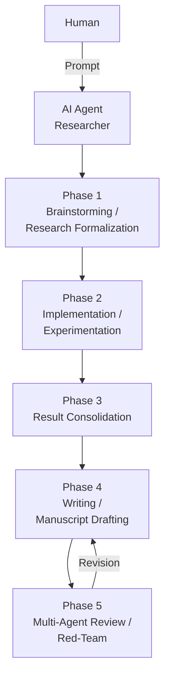

# My AI Research Copilot

<p align="center">
  
</p>

A research operating system for turning broad ideas into defensible evidence, manuscripts, and revisions.

## Agentic Workflow



The workflow is intentionally phased and file-backed:

1. Phase 1 turns a broad idea into a formal research package.
2. Phase 2 turns the approved direction into implementation and experiments.
3. Phase 3 turns runs into structured evidence.
4. Phase 4 turns evidence into a manuscript draft, section by section.
5. Phase 5 turns the draft into review feedback and revision guidance.

## Core Gate

- idea before implementation
- evidence before claims
- citations before manuscript polish
- review before submission
- revision before closure

## Persistent Memory

- `docs/current_status.md` — short live state pointer
- `docs/workflow_state_machine.md` — canonical phase and transition model
- `docs/research_gates.md` — decision gates before major research direction, source-reading, implementation, experiment, evaluation, claim, writing, or review changes
- `docs/research_context.md` — stable, high-level project snapshot created in Phase 1
- `docs/agent/` — research workflow artifacts
- `paper/agent/` — manuscript-support and review artifacts
- `sources/` — external evidence artifacts

## Skills and Guidance

### Environment

- `.env.example` lists the environment variables used by repo-owned skills.
- Real secrets belong in local `.env` files or user environment variables.
- `.env` files are ignored; `.env.example` is safe to commit.
- `OPENROUTER_API_KEY` is the default image-generation backend key; `GEMINI_API_KEY` and `OPENAI_API_KEY` are available for direct-provider image backends.

### MCP Setup

- `mcp-configurer` sets up and audits the approved MCP server set across Codex, Cursor, Claude Code, Gemini CLI, and Antigravity.
- `.codex/config.toml` is the Codex project config already checked into this repo.
- `HF_TOKEN` and `GITHUB_PERSONAL_ACCESS_TOKEN` are the expected auth placeholders in `.env.example`.

### Core Skills

- `research-lookup`: find candidate papers, datasets, benchmarks, and prior work.
- `zotero`: compatibility wrapper for local Zotero library operations and direct helper commands.
- `literature-review`: synthesize sources into themes, gaps, and baseline context.
- `citation-management`: verify references, BibTeX, DOI/arXiv metadata, and citation hygiene.
- `claim-auditor`: check whether claims are supported by evidence, citations, and artifacts.
- `scientific-critical-thinking`: pressure-test novelty, leakage, methodology, and experiment decisiveness.
- `theoretical-lens`: identify load-bearing mathematical framings for a failure mode or design choice, with mandatory rigor labeling; use sparingly.
- `peer-review`: simulate reviewer critique with distinct reviewer roles and a meta-review.
- `scientific-writing`: draft evidence-first manuscript prose without inventing support.
- `results-scaffold`: create result tables, ablations, and evidence placeholders without fabricating metrics.
- `prior-style-adapter`: adapt prose to prior-paper style from `paper/style/`.
- `venue-templates`: enforce venue formatting, structure, and submission constraints.
- `scientific-schematics`: create evidence-aware technical diagrams and workflows.
- `generate-image`: create non-technical visual assets only.
- `mcp-configurer`: configure the approved MCP server set across supported clients.
- `workflow-manager`: manage the repository's agentic workflow skeleton, phase routing, and workflow-state checks.

### Guidance Files

- Use the smallest relevant subset of `.agents/guidance/*.md` when a task needs execution constraints.
- `ai-ml-research-dev.md`: reproducibility, experiment tracking, leakage checks, monitoring, and deployability.
- `cv-dev.md`: production computer-vision engineering, data/label contracts, train/serve parity, deployment realism, and performance constraints.
- `cv-researcher.md`: computer-vision research tasks, baselines, ablations, evaluation design, slice analysis, and qualitative failure analysis.
- `python-dev.md`: Python engineering, packaging, typing, testing, logging, and reliability.

### Workflow References

- `AGENTS.md`: repo-wide operating rules and phase contracts.
- `paper/AGENTS.md`: manuscript-specific rules before writing in `paper/`.
- `docs/workflow_state_machine.md`: canonical phase-transition source of truth.
- `docs/research_gates.md`: decision gates before major research direction, source-reading, implementation, experiment, evaluation, claim, writing, or review changes.
- `docs/current_status.md`: shared live state, not chat memory.
- `docs/research_context.md`: stable, high-level project snapshot; initialized from `.agents/templates/RESEARCH_CONTEXT.template.md` in Phase 1.

## Repository Map

```text
AGENTS.md
.agents/
  guidance/
  skills/
    workflow-manager/
.codex/
docs/
  current_status.md
  workflow_state_machine.md
  research_gates.md
  research_context.md
  agent/
paper/
  AGENTS.md
  agent/
  style/
scripts/
tests/
  agent/
sources/
src/
runs/
outputs/
```

## Operating Rule

Do not let the agent treat chat as memory. Important outputs belong in files, and `docs/current_status.md` should reflect the current phase, active artifact paths, blockers or open questions, and next action. If the status is still `template_default`, the agent should bootstrap or route through intake before treating it as project truth.

## References

This workflow was informed by and inspired by:

- [AI Agents for Scientific Workflow Automation: From Hypothesis to Experiment](https://medium.com/@khayyam.h/ai-agents-for-scientific-workflow-automation-from-hypothesis-to-experiment-c1ab5043dc00)
- [Improving the academic workflow: introducing two AI agents for better figures and peer review](https://research.google/blog/improving-the-academic-workflow-introducing-two-ai-agents-for-better-figures-and-peer-review/)
- [Towards end-to-end automation of AI research](https://www.nature.com/articles/s41586-026-10265-5)
- [K-Dense-AI/scientific-agent-skills](https://github.com/K-Dense-AI/scientific-agent-skills)
